# dbskill

把说不清、推不动、需要判断或整理的真实任务，变成当前可以继续推进的一步。

dbskill 由自媒体博主 dontbesilent 创建，全网可搜 `@dontbesilent 聊赚钱`。dontbesilent 累计发布 16152 条推文，dbskill 将其中经过筛选的内容整理为 4176 个知识原子和 26 个 AI Skills。

适用于任何有真实任务需要推进的人。你可以交付问题、材料、目标、选择或持续卡点，dbskill 会根据当前信息调用合适的 Skill。

**最新更新：v2.17.6**

**v2.17.6 更新**：修复 Claude Code 插件更新版本。所有 marketplace 插件版本随发布版本同步递增，`claude plugin update` 可以识别新版本并更新缓存。

已有用户可执行：

```bash
claude plugin marketplace update dontbesilent-skills
claude plugin update dbs@dontbesilent-skills
```

[新手从这里开始](docs/新手入门.md) · [查看全部 Skill](docs/新手入门.md#skill-全目录) · [安装 dbskill](#安装) · [关注作者](https://x.com/dontbesilent)

## 你可以用它做什么

| 你交付的内容 | dbskill 会帮你做什么 |
|---|---|
| 一个还没想清楚的问题 | 澄清对象、边界与关键矛盾，找到当前需要判断的结点 |
| 一段需要处理的内容或材料 | 分析、诊断、改进或整理成可以继续使用的产出 |
| 一个需要判断的目标或选择 | 拆清条件、风险和验证方式，形成当前决策 |
| 一件推进不下去的任务 | 找到行动卡点，给出能实际开始的动作 |
| 一批需要长期使用的资料 | 建成可检索、可重组、可继续生长的本地工程 |
| 一个需要持续跟踪的主题 | 保存结论、回填结果、整理报告，形成长期记忆 |

## 从第一次提问开始

安装后，第一次使用直接输入：

```text
/dbs 新手入门
```

dbskill 会说明你可以交付什么、系统怎样工作、可能得到什么结果。你提交真实任务后，它会选择合适的 Skill；每次只决定当前一步，后续方向由实际结果决定。

你也可以直接输入 `/dbs`，然后提交任何真实任务：

```text
我有一个问题还没想清楚：……
这段内容／材料想请你处理：……
我需要判断一个选择：……
这件事一直推进不下去：……
```

`/dbs` 会读取当前对话里已有的信息，自动选择当前最合适的一个 Skill。需要完整示例和每个 Skill 的说明时，阅读 [dbskill 新手入门](docs/新手入门.md)。



已经知道要做什么时，可以直接调用：

```text
/dbs-diagnosis 我做面向宝妈的收纳咨询，客户总觉得贵。我该降价还是换交付？
/dbs-content 我想讲“普通人别急着做个人 IP”，这个选题怎么做？
/dbs-hook 这是我短视频的前 20 秒，帮我优化开头：……
/dbs-benchmark 我想研究做企业服务内容的账号，帮我找对标。
```

## 作者与答疑

作者：[X](https://x.com/dontbesilent) · [小红书](https://xhslink.com/m/637xuspR4iI) · [抖音](https://v.douyin.com/pRUDhpBqOrc/)

如需加入付费答疑群，可扫描下方二维码，或直接打开 [查看答疑群](https://mp.weixin.qq.com/s/V7Dr0-75VYZOLJ6lbT_s0w)。


## 安装

### Codex、Claude Code 与其他支持 Skills 的 Agent

```bash
npx -y skills add dontbesilent2025/dbskill -g --all
```

已经安装 dbskill 后，直接对 Agent 说「更新 dbskill」。Agent 会同步官方 dbskill；你不需要复制更新命令。

### Claude Code 插件市场

```bash
claude plugin marketplace add dontbesilent2025/dbskill
claude plugin install dbs@dontbesilent-skills
```


本地构建时运行：

```bash
bash tools/build-skills.sh
```

产物位于 `dist/skills/`。构建脚本会跳过名称带 `beta` 的本地试验 Skill。

## 常见场景与当前入口

dbskill 每次只解决当前最关键的一步。完成后输入 `/dbs`，它会读取刚才的结论和你的新反馈，再推荐下一步；后续动作不预先排成固定链条。

### 判断一个方向值不值得做

```text
/dbs-diagnosis
```

先诊断方向、商业模式或定价问题。诊断结论可能提示你寻找对标、记录一个决策，或回到业务现场验证；由 `/dbs` 结合当前结论判断。

### 从零开始做内容

```text
/dbs
```

说清业务、受众和目标。`/dbs` 会选择当前需要的一个内容相关 Skill；内容方向、开头、标题和逐字稿检查会在不同结果下进入。

### 写完内容到发布

```text
/dbs-resonate
```

先判断文稿有没有击中目标受众。结论会决定接下来更需要修改逻辑、处理开头、检查表达，或进入排版发布。

### 知道该做却一直做不动

```text
/dbs-action
```

先找行动卡住的具体信号。后续可能需要审计目标、重新诊断业务方向，或评估值得承担的摩擦。

### 把旧内容变成资产

```text
/dbs-content-system
```

先将文稿、推文、选题、案例和课程稿搭成内容工程。工程建成后的下一步由实际素材、主题地图和当前任务决定。

每个场景的输入示例见 [新手入门教程](docs/新手入门.md#常见场景与动态导航)。

## 直接调用的 Skill

dbskill 当前正式发布 26 个 Skill。下面按用户目标列出入口；每个 Skill 的适用时机、输入示例、预期产出与衔接关系见 [完整 Skill 手册](docs/新手入门.md#skill-全目录)。

| 目标 | 直接调用 |
|---|---|
| 不知道从哪里开始，或完成一轮工作后找下一步 | `/dbs` |
| 判断生意、产品、定价或客户 | `/dbs-diagnosis` |
| 找值得研究的对标 | `/dbs-benchmark` |
| 诊断内容方向与做法 | `/dbs-content` |
| 优化短视频开头、标题、文稿共鸣或逻辑 | `/dbs-hook`、`/dbs-xhs-title`、`/dbs-resonate`、`/dbs-script-flow` |
| 分析内容为什么传播、检查 AI 写作痕迹 | `/dbs-spread`、`/dbs-ai-check` |
| 生成微信公众号 HTML | `/dbs-wechat-html` |
| 拆概念、审计目标、把问题写清楚 | `/dbs-deconstruct`、`/dbs-goal`、`/dbs-good-question` |
| 处理拖延、贪快和行动受阻 | `/dbs-action`、`/dbs-slowisfast` |
| 持续学习、决策回填与项目记忆 | `/dbs-learning`、`/dbs-decision`、`/dbs-save`、`/dbs-restore`、`/dbs-report` |
| 把大量素材搭成内容资产工程 | `/dbs-content-system` |
| 多视角讨论或奥派经济学讨论 | `/dbs-chatroom`、`/dbs-chatroom-austrian` |
| 整理或桥接多端 Agent 工作台 | `/dbs-agent-migration`、`/dbs-bridge` |

## 知识库

项目公开了 4,176 条结构化知识原子、按 Skill 整理的方法论知识包和高频概念词典。你可以安装整套 Skill，也可以单独取用其中一部分。


- 想了解字段、主题和数据范围，阅读 [原子库说明](知识库/原子库/README.md)。
- 想做 RAG，将 `知识库/原子库/atoms.jsonl` 导入向量数据库。
- 想给自己的 AI 加商业诊断能力，使用 `知识库/Skill知识包/diagnosis_公理与诊断框架.md` 作为系统提示词背景。
- 想看方法论文档，浏览 [Skill 知识包](知识库/Skill知识包)。

## 进阶使用

### 存档、接续与报告

对话关闭后，当前上下文不会自动保留。需要跨对话继续时：

```text
/dbs-save 训练营定价判断
/dbs-restore
/dbs-report
```

存档默认位于 `~/.dbs/sessions/{项目名}/`，报告默认位于 `~/.dbs/reports/{项目名}/`。完整规则见 [新手入门中的状态管理说明](docs/新手入门.md#行动学习与长期记录)。

### 多端使用

`/dbs-agent-migration` 可以审计并整理 Claude Code、Codex、Grok 与通用 Agents 的规则文件和 Skill 真源。`/dbs-bridge` 可将一个 Skill 或整个 `skills/` 目录桥接到这些 Agent。

## 更新

已经安装 dbskill 后，直接对当前 Agent 说：

```text
更新 dbskill
```

`/dbs-update` 只同步官方 dbskill，不更新其他 Skill，也不会修改你在 `~/.dbs/` 中的存档、报告和决策记录。当前 Agent 没有立即读取到新能力时，新建一次对话后再使用。

版本变更见 [GitHub Releases](https://github.com/dontbesilent2025/dbskill/releases)。当前版本：`v2.17.6`。

## 许可证

本项目采用 [CC BY-NC 4.0](https://creativecommons.org/licenses/by-nc/4.0/) 许可证。

- 个人使用、学习、研究、非商业项目：不需要署名，不需要申请。
- 公开发布衍生作品（文章、工具、课程等）：请注明来源。
- 商业用途：需要单独授权，请联系作者。
